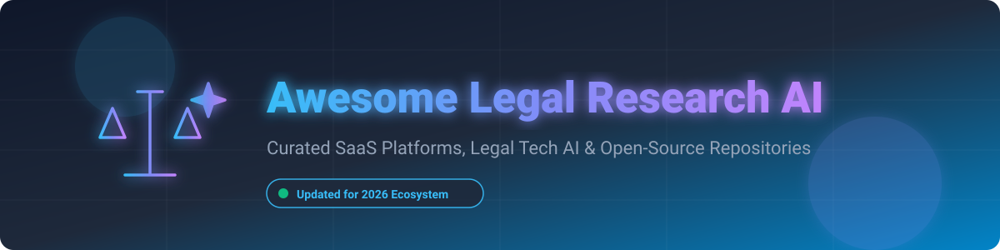

  

# ⚖️ Awesome Legal Research AI Ecosystem

  
  
  
  

> 🚀 A curated list of top SaaS platforms, enterprise AI tools, and open-source GitHub projects for Legal Research AI, AI-assisted case law research, citation analysis, legal Q&A, memo drafting, and generative legal work.

---

## 📚 Table of Contents
- [📊 Market Overview & Industry Structure](#-market-overview--industry-structure)
- [🏢 SaaS & Enterprise Legal AI Platforms](#-saas--enterprise-legal-ai-platforms)
- [💻 Open-Source Legal AI GitHub Repositories](#-open-source-legal-ai-github-repositories)
- [🏗️ Open-Source Legal Tech Stack & Architecture](#%EF%B8%8F-open-source-legal-tech-stack--architecture)
- [🤝 How to Contribute](#-how-to-contribute)
- [💖 Support & Sponsorship](#-support--sponsorship)
- [📈 Star History](#-star-history)
- [⚠️ Disclaimer](#%EF%B8%8F-disclaimer)

---

## 📊 Market Overview & Industry Structure

> 💡 **Market Size & Outlook:** The global Legal AI software market is projected to reach **$3.7B to $10.8B by 2030**, growing at a **CAGR of 17%–31%**.
>
> 🏛️ **Industry Structure:** The sector is **moderately fragmented** but undergoing aggressive consolidation. While specialized operational nodes (contract review, litigation analytics, eDiscovery) allow multiple niche winners, major incumbents (Thomson Reuters, LexisNexis, RELX) and well-funded legal AI unicorns (Harvey AI) are building strong data moats and platform ecosystems around daily attorney workflows.

---

## 🏢 SaaS & Enterprise Legal AI Platforms

The table below lists leading commercial SaaS products and enterprise platforms for AI legal research, document review, and legal drafting, sorted in **descending order by company valuation / revenue scale**.

| Platform | Starting Price | Free Trial / Access Limit | Estimated Valuation / Scale | Key Capabilities |
| :--- | :--- | :--- | :--- | :--- |
| 🔹 **[Lexis+ AI](https://www.lexisnexis.com/)** | ~$125/user/month (Add-on to base subscription) | 7-day sales-qualified trial | **~$50B+ Parent Valuation** (RELX Group, $4B+ division revenue) | Generative research, Shepard's citation validation, legal drafting, and answer-to-source linking. |
| 🔹 **[Westlaw Precision AI / CoCounsel](https://legal.thomsonreuters.com/)** | ~$150/user/month (Tiered enterprise quote) | 7-day sales-qualified trial | **~$35B+ Parent Valuation** (Thomson Reuters, $6.8B+ annual revenue) | Integrated Westlaw Precision AI search, KeyCite authority verification, and document analysis. |
| 🔹 **[Harvey AI](https://www.harvey.ai/)** | ~$1,200/user/month ($20k+ annual firm min.) | No free trial (Enterprise sales & pilot only) | **$15.5B Valuation** ($350M+ ARR) | Custom LLM workflows for BigLaw and corporate legal departments across research, drafting, and analysis. |
| 🔹 **[vLex Vincent](https://vlex.com/)** | ~$69/user/month (Individual starter rate) | 7-day demo / trial upon request | **$1.0B Valuation** (Acquired by Clio for $1B in Nov 2025) | Multi-jurisdictional AI research assistant with global primary law coverage and citator tools. |
| 🔹 **[Casetext CoCounsel](https://casetext.com/)** | ~$110/user/month (Enterprise packages) | Sales-facilitated demo trial | **$650M Acquisition** (Acquired by Thomson Reuters in Aug 2023) | AI legal assistant specializing in document review, case law research, and deposition prep. |
| 🔹 **[Spellbook](https://www.spellbook.legal/)** | ~$289/user/month (Annual seat estimate) | 7-day free trial available | **~$350M Valuation** ($80M+ total funding) | Microsoft Word native AI copilot for contract drafting, clause suggestion, and legal review. |
| 🔹 **[Darrow](https://www.darrow.ai/)** | ~$350/user/month (Plus performance fee) | Request-based trial demo | **~$250M Est. Valuation** ($31.4M ARR, $60M+ funding) | Justice Intelligence Platform detecting legal violations, class action merit, and litigation opportunities. |
| 🔹 **[Paxton AI](https://www.paxton.ai/)** | $499/user/month ($2,999/user/year) | 14-day free trial available | **~$120M Est. Valuation** ($28M total funding) | AI legal research and drafting platform with transparent pricing for mid-market law firms. |
| 🔹 **[Leya AI](https://www.leya.law/)** | ~$250/user/month (Enterprise custom quote) | Demo request (No self-serve trial) | **~$100M Est. Valuation** (~$25M ARR, $10M+ seed) | European legal AI workspace connecting firm document repositories with legal research pipelines. |
| 🔹 **[LawGeex](https://www.lawgeex.com/)** | Enterprise custom quote (Legacy vendor) | Contact sales | **Restructured Assets** (Enterprise portfolio acquired 2023) | Automated contract review platform evaluating incoming contracts against corporate playbooks. |

---

## 💻 Open-Source Legal AI GitHub Repositories

Below are key open-source GitHub repositories, tools, datasets, and MCP servers driving accessible legal AI, sorted in **descending order by GitHub star count**.

| Repository | GitHub Stars | Description |
| :--- | :--- | :--- |
| ⚡ **[OpenSign](https://github.com/opensign-labs/opensign)** |  | Free and open-source document e-signing platform alternative to DocuSign. |
| ⚡ **[Open-Legal-Products / Mike](https://github.com/open-legal-products/mike)** |  | Open-source Legal AI platform designed for legal document review, drafting, and RAG research. |
| ⚡ **[OpenContracts](https://github.com/Open-Source-Legal/OpenContracts)** |  | Open document intelligence and annotation platform for contract analysis, parsing, and LLM querying. |
| ⚡ **[CourtListener](https://github.com/freelawproject/courtlistener)** |  | Massive open legal database engine indexing U.S. federal & state court opinions, dockets, and judicial records. |
| ⚡ **[Juriscraper](https://github.com/freelawproject/juriscraper)** |  | Python scraper library pulling court opinions, oral arguments, and dockets across U.S. court websites. |
| ⚡ **[Awesome LegalTech](https://github.com/chen-friedman/awesome-legaltech)** |  | Curated index of open-source legal AI tools, legal technology software, legal datasets, and AI benchmarks. |
| ⚡ **[Eyecite](https://github.com/freelawproject/eyecite)** |  | High-performance Python legal citation extractor used to parse, normalize, and verify legal authorities. |
| ⚡ **[LegalQuants / LQ-AI](https://github.com/LegalQuants/lq-ai)** |  | Self-hosted, privacy-focused open-source legal AI platform featuring CourtListener MCP integration and citation verification. |
| ⚡ **[GitLaw (German Federal Law)](https://github.com/mikelninh/gitlaw)** |  | Source-grounded legal research RAG pipeline providing transparent answers and citations for German statutes. |
| ⚡ **[CourtListener MCP Server](https://github.com/cyanheads/courtlistener-mcp-server)** |  | Open Model Context Protocol (MCP) server enabling AI assistants (Claude, Cursor) to search CourtListener case law live. |

---

## 🏗️ Open-Source Legal Tech Stack & Architecture

While commercial enterprise legal AI is dominated by proprietary database vendors (LexisNexis, Westlaw), developers can construct fully source-grounded open-source legal AI stacks using public domain components:

1. 📥 **Data Ingestion & Extraction**: Scrape U.S. case law and court dockets with **[Juriscraper](https://github.com/freelawproject/juriscraper)** or fetch clean public domain corpora from **[CourtListener](https://github.com/freelawproject/courtlistener)** APIs.
2. 🔍 **Citation Parsing & Normalization**: Extract and validate legal citations in raw text using **[Eyecite](https://github.com/freelawproject/eyecite)**.
3. 🔌 **AI Protocol Integration (MCP)**: Connect LLMs to legal datasets using standardized **Model Context Protocol (MCP)** servers to ground AI responses directly in primary law sources.
4. 🧠 **Retrieval-Augmented Generation (RAG)**: Index primary legal sources in vector stores and build citation-validated RAG pipelines to eliminate AI hallucinated precedent.

---

## 🤝 How to Contribute

Contributions are welcome! To contribute to this curated legal AI repository:

1. 🍴 Fork this repository.
2. 📝 Add your product or open-source repository to `README.md` maintaining table structure and formatting.
3. 📊 Provide accurate pricing, trial details, valuation/revenue estimations, or GitHub repository links.
4. 🔀 Open a Pull Request with a short summary of changes.

---

## 💖 Support & Sponsorship

Thank you for exploring and using **Awesome-Legal-Research-AI**! 🌟 

If you find this repository valuable for your work, legal practice, research, or projects, please consider supporting the project:

- ⭐ **Star this repository** on GitHub to help others discover it.
- 🔀 **Fork & Share** it with your team, colleagues, or legal tech communities.
- ☕ **Buy me a coffee**: Support ongoing open-source curation and maintenance via the [GitHub Sponsor Dashboard](https://github.com/sponsors/ishandutta2007).

---

## 📈 Star History

---

## ⚠️ Disclaimer

- 📌 This list is **community-curated** for educational and research purposes.
- 🚨 **Legal Advice Warning**: Generative legal AI tools can hallucinate citations and misinterpret legal statutes. All output must be reviewed and verified by a qualified attorney. This repository does not constitute legal advice.

---

  <b>Built with ❤️ for attorneys, legal technologists, and developers advancing transparent, source-grounded Legal AI.</b>

